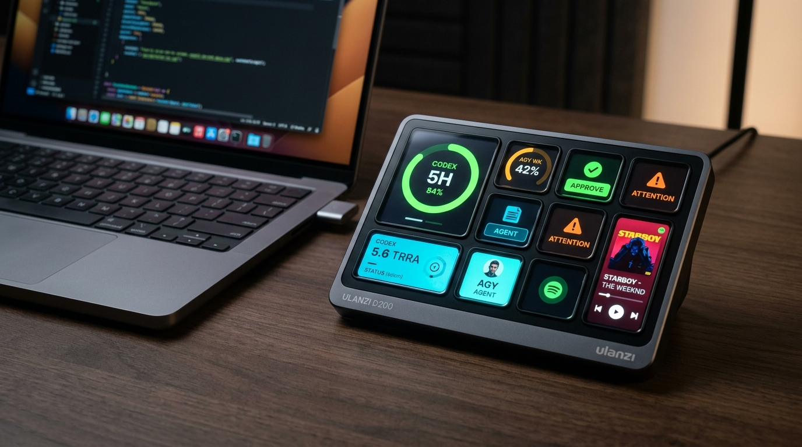
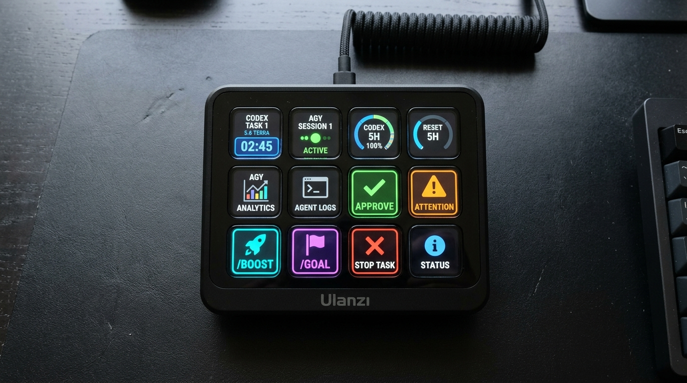

# OpenCodexMicro

**Control Codex Desktop, Antigravity AI Agent, and Spotify from Ulanzi D200 Series Keypads through Ulanzi Studio.**

[中文说明](README_zh.md)

OpenCodexMicro connects developer tools and media controls to your Ulanzi D200 keypad via native Ulanzi Studio plugins and loopback bridges. It provides dedicated plugins for **Codex Desktop**, **Antigravity AI Agent**, and **Spotify Music Picker**.



## Features Overview

<p align="center">
  
</p>

### Codex Desktop Integration
| Feature | Behavior |
| --- | --- |
| **Five Live Task Cards** | Display Codex recent tasks with model tags (`5.6 TERRA`, `Claude 3.7`), live elapsed timers, state badges (`WORKING`, `COMPLETED`, `ATTENTION`, `IDLE`), and conversation titles. |
| **Dedicated 5H & Weekly Gauges** | Large circular progress rings showing remaining 5-Hour and Weekly allowances with live countdown to reset (`RESET 2H 15M`, `RESET 5H`, `RESET 7D`). |
| **Task & Token Monitor** | Monitor active task type, model reasoning effort (Low/Med/High), and token / context window consumption. |
| **Agent Controls & Approvals** | Instant `APPROVE` / `PROCEED`, `CANCEL` / `DENY`, and Attention alert notification counters. |
| **Quick Action Prompts** | One-tap prompt triggers for Test & Fix, Code Review, and Conventional Commit message generation. |
| **Encoder Navigation** | Press to open the latest task; turn left/right to scroll up/down through Ulanzi Studio's hotkey protocol. |

### Antigravity AI Agent Integration
| Feature | Behavior |
| --- | --- |
| **Five Live Session Cards** | Display active Antigravity sessions, execution states, model indicators, and elapsed timers. |
| **Agent Status HUD** | Real-time agent status HUD (`PLANNING`, `EXECUTING`, `WAITING`, `IDLE`) with session title and live timer. |
| **One-Touch Approvals** | One-touch `PROCEED` (Approve Plan / Tool Calls) and `CANCEL` (Stop execution) keys. |
| **Subagents & Token Monitor** | Live subagent counter, cumulative session token tracker, and context window gauge. |
| **AI Slash Commands** | Dedicated single-tap buttons for `/boost`, `/grill-me`, and `/goal` autonomous agent workflows. |
| **Artifact Viewers** | Single-tap keys to immediately focus and open active Implementation Plans and Walkthrough artifacts in VS Code. |

### Spotify Music Picker & Controller
| Feature | Behavior |
| --- | --- |
| **Now Playing HUD** | Wide-screen display with track title, artist, album art, and progress bar. |
| **Music Picker Slots 1–10** | Quick-access playlist, album, and mix slots with live playback status. |
| **Playback & Volume Controls** | Play/Pause, Skip Next, Previous, Like, Shuffle, Repeat, and Rotary Volume / Playlist Scroll Dials. |

### Security & Transport
| Transport | Security Model |
| --- | --- |
| **Loopback-only Endpoints** | Codex Bridge (`127.0.0.1:17373` & CDP `127.0.0.1:9222`) and Antigravity Bridge (`127.0.0.1:17374` & WS `127.0.0.1:17375`) bind strictly to localhost. |

---

## Installation

### Prerequisites

- macOS 13 (Ventura) or later;
- Codex Desktop and/or Antigravity (VS Code);
- Ulanzi Studio 3.0.1 or later;
- Ulanzi D200 Series connected to Ulanzi Studio;
- Node.js 20 or newer (for repository-based installation and bridge runtime).

---

### 1. Quick Installation (All Plugins & Bridges)

To install all plugins and build/register both bridges in one go:

```bash
git clone https://github.com/UlanziTechnology/OpenCodexMicro.git
cd OpenCodexMicro
npm install
npm run install:all
npm run setup:all
```

> **Note:** Quit Ulanzi Studio before running `npm run install:all`.

---

### 2. Selective Installation

#### Codex Micro Plugin & Bridge
```bash
# Install the Codex Micro plugin in Ulanzi Studio
npm run install:plugin

# Build and register the Codex Bridge LaunchAgent (~/Applications/Codex Bridge.app)
npm run setup
```

#### Antigravity Plugin & Bridge
```bash
# Install the Antigravity plugin in Ulanzi Studio
npm run install:plugin:antigravity

# Build and register the Antigravity Bridge LaunchAgent
npm run setup:antigravity
```

#### Spotify Music Picker Plugin
```bash
# Install the Spotify plugin in Ulanzi Studio
npm run install:plugin:spotify
```

---

### 3. Launching & Verification

#### Codex Desktop
Always launch Codex Desktop via `Codex Bridge.app` to enable the local CDP debugging port:

```bash
open ~/Applications/Codex\ Bridge.app
```

Verify the Codex Bridge health and state:
```bash
curl http://127.0.0.1:17373/health
curl http://127.0.0.1:17373/state
```

#### Antigravity Bridge
The Antigravity Bridge runs automatically via its LaunchAgent (`io.openantigravitymicro.bridge`). Verify with:
```bash
curl http://127.0.0.1:17374/health
curl http://127.0.0.1:17374/state
```

#### In Ulanzi Studio
1. Launch Ulanzi Studio.
2. In the action list, you will find the **AI** category (with **Codex Micro** and **Antigravity** actions) and the **Music** category (with **Spotify Music Picker** actions).
3. Drag the actions onto the desired keys on your Ulanzi D200 canvas.

---

### 4. LLM / Agent Installation Workflow

When an LLM or coding agent performs the setup:

1. Read [AGENTS.md](AGENTS.md) and inspect the installed plugin manifests under `~/Library/Application Support/Ulanzi/UlanziDeck/Plugins/`.
2. Check for the target plugin UUIDs:
   - Codex Micro: `com.ulanzi.ulanzistudio.codexmicro`
   - Antigravity: `com.ulanzi.ulanzistudio.antigravity`
   - Spotify: `com.ulanzi.ulanzistudio.spotify`
3. If installing or repairing, follow [`skills/install-ulanzi-studio-plugin/SKILL.md`](skills/install-ulanzi-studio-plugin/SKILL.md) and [`skills/setup-codex-bridge/SKILL.md`](skills/setup-codex-bridge/SKILL.md).
4. Report plugin installation and bridge connectivity status clearly.

---

## Configuration & Layout

The physical layout is managed directly inside Ulanzi Studio.

- **System Accessibility Permission**: Enable Ulanzi Studio in **System Settings > Privacy & Security > Accessibility** so the rotary encoders can send scroll/mouse-wheel events.
- See [Configuration](docs/configuration.md) for full action documentation and recommended key layouts.
- See [Setup and operations](docs/setup-and-operations.md) for background service management, logs, and troubleshooting.

---

## Documentation

- [Configuration Guide](docs/configuration.md)
- [Setup and Operations](docs/setup-and-operations.md)
- [Architecture Overview](docs/architecture.md)
- [Engineering Constraints](docs/errors.md)

---

## License & Attribution

Project-authored code is released under the [MIT License](LICENSE). See [NOTICE.md](NOTICE.md) for upstream attribution, maintainership scope, independence notices, and responsibility boundaries. Dependencies are documented in [THIRD_PARTY_NOTICES.md](THIRD_PARTY_NOTICES.md).
