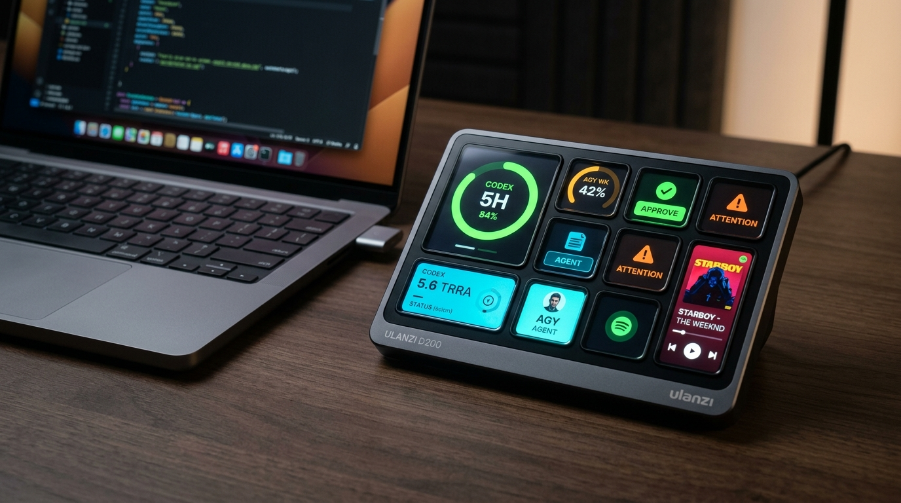

# OpenCodexMicro

Control Codex Desktop, Codex CLI, Antigravity Desktop and Spotify from an Ulanzi
D200 Series keypad through Ulanzi Studio.

[中文简介](README_zh.md)

## Components

Ulanzi Studio owns the physical device. Four native plugins connect to the
applications through local interfaces:

| Plugin | Connection | Main capabilities |
| --- | --- | --- |
| Codex App | Codex Bridge on `127.0.0.1:17373`; Desktop CDP on `127.0.0.1:9222` | Six task keys, status/usage, selected-task controls and native navigation |
| Codex CLI | CLI bridge on `127.0.0.1:17376`; managed app-server over a Unix WebSocket | Six task keys, approvals, task-bound drafts, next-prompt settings and plans |
| Antigravity | Desktop bridge on `127.0.0.1:17374` | Six session keys, selected-conversation controls, history and saved artifacts |
| Spotify | Local API inside the plugin on `127.0.0.1:17375` | Playback, track display, ten music slots, volume and optional Web API catalog/library access |

The three developer bridges serve WebSocket `/events` on their HTTP port.
Local APIs require private credentials; use the repository's diagnostic helper.
Similar action names do not guarantee identical behavior across applications.
See [capabilities and acceptance](docs/feature-parity.md) for supported controls,
explicitly unavailable features and live verification limits.

## Windows (experimental)

Build isolated Windows packages with `npm run build:windows`. See
[Windows setup and compatibility](docs/windows.md) for the separate installers,
authenticated CLI server and application requirements. Codex App requires a
CDP-capable build; Microsoft Store compatibility is not guaranteed. The macOS
installation commands and manifests below remain unchanged.

## Installation and configuration

Requires macOS 13+, Node.js 20+, Ulanzi Studio 3.0.1+, an Ulanzi D200 Series deck
and the applications for your selected plugins. CLI integration requires the
standalone managed app-server installation.

Follow [setup and operations](docs/setup-and-operations.md) for installation,
updates, deck configuration, logs, diagnostics and removal. Install only the
components you need. Quit Studio before replacing plugins. Launching
`Codex Bridge.app` quits and relaunches Codex Desktop, so save work first and do
not open it merely to check installation.

## Development and agent instructions

[AGENTS.md](AGENTS.md) is the repository's operating guide for coding agents. It
maps canonical source files, runtime contracts, generated artifacts and targeted
validation commands. Read it before setup or development. The two focused skills
cover [prebuilt Codex plugin installation](skills/install-ulanzi-studio-plugin/SKILL.md)
and [Codex Bridge setup](skills/setup-codex-bridge/SKILL.md).

## License and attribution

Project-authored code is released under the [MIT License](LICENSE).
[NOTICE.md](NOTICE.md) defines provenance, independence and responsibility;
Ulanzi's declared maintenance scope is the Codex App plugin directory, not the
inherited Bridges or CDP. [THIRD_PARTY_NOTICES.md](THIRD_PARTY_NOTICES.md) records
dependency licenses. Their copies inside the plugin installer are required
parts of the distribution.
